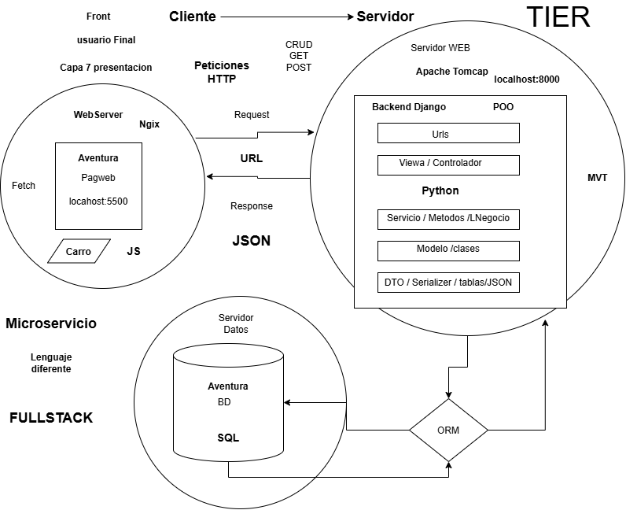

# Django_ApiRest_CarroCompraBack
ApiRest Carro de Compra, desarrollado en Python con Django y Base de datos. Para arquitectura Microservicio, donde revice peticiones HTTP desde un una pagina Web, Ecommerce, visualiza catalogo de productos, procesa compra y emite boleta.

Este se conecta directamente con el Front (Pagina Web, tipo ecommerce, muestra catalogo de productos, almacenados en un base de datos, la cual se accede a traves de la ApiRest).

## 🏛️ Arquitectura del Sistema

